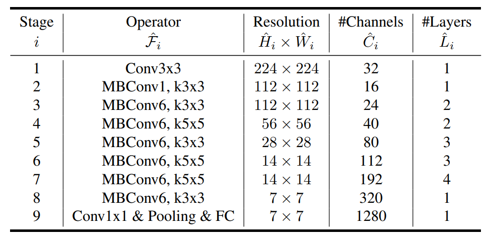

# EfficientNet Architecture
Reference : https://arxiv.org/pdf/1905.11946.pdf

### EfficientNet Intuition
→ Balancing all dimensions of network width, depth, and resolution is crucial for achieving better accuracy and efficiency in ConvNet scaling. 
→ Intuitively, for higher resolution images, we should increase network depth, such that the larger receptive fields can help capture similar
    features that include more pixels in bigger images. Correspondingly, we should also increase network width when resolution is higher, in order to capture more fine-grained patterns with more pixels
    in high resolution images. 
→ In this paper, we propose a new compound scaling method, which use a compound coefficient φ to uniformly scales network width, depth, and resolution in a principled way: 
→ here α, β, γ are constants that can be determined by a small grid search. Intuitively, φ is a user-specified coefficient that controls how many more resources are available
for model scaling, while α, β, γ specify how to assign these extra resources to network width, depth, and resolution respectively  

